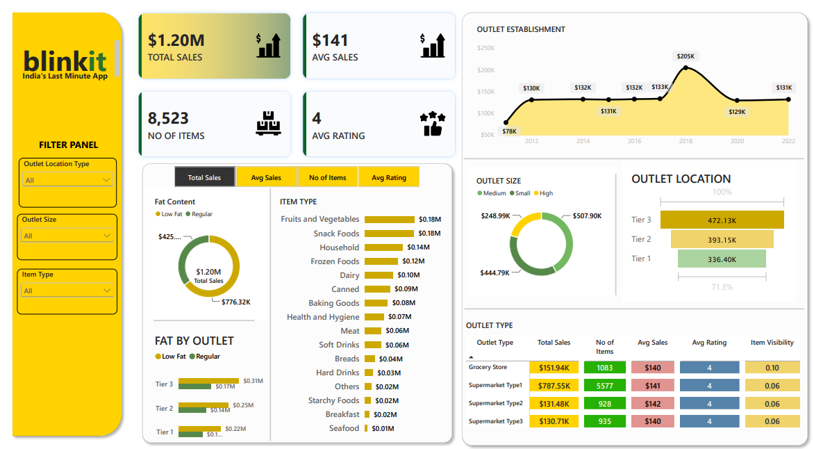

# Blinkit Data Analysis

An end-to-end data analysis project using **Python, MySQL, and Power BI** to clean, analyze, and visualize Blinkit grocery sales data.

## Dashboard Preview



## Project Overview

The goal of this project is to analyze grocery sales data and identify useful business insights related to:

- Total and average sales
- Number of items
- Average customer rating
- Sales by fat content
- Sales by item type
- Sales by outlet establishment year
- Sales by outlet size
- Sales by outlet location
- Performance by outlet type

## Tools & Technologies

- **Python (Pandas)** – Data cleaning and preprocessing
- **MySQL** – SQL analysis and KPI calculations
- **Power BI** – Interactive dashboard and data visualization
- **Excel / CSV** – Raw and cleaned datasets

## Project Workflow

```text
Raw Excel Data
      ↓
Python Data Cleaning
      ↓
Cleaned CSV
      ↓
MySQL Database
      ↓
SQL Analysis
      ↓
Power BI Dashboard
```

## Data Cleaning

The dataset was cleaned using Python and Pandas.

Main cleaning steps:

- Converted column names to lowercase
- Replaced spaces in column names with underscores
- Standardized inconsistent `item_fat_content` values
- Checked missing values
- Filled missing `item_weight` values using the median
- Checked and removed duplicate records
- Exported the cleaned dataset to CSV

## SQL Analysis

SQL was used to calculate and analyze:

- Total Sales
- Average Sales
- Number of Items
- Average Rating
- Total Sales by Fat Content
- Total Sales by Item Type
- Total Sales by Outlet Establishment Year
- Sales by Outlet Size
- Sales Percentage by Outlet Size
- Sales by Outlet Location
- Fat Content Sales by Outlet Location
- All Metrics by Outlet Type

## Dashboard KPIs

| KPI | Result |
|---|---:|
| Total Sales | **$1.20M** |
| Average Sales | **$141** |
| Number of Items | **8,523** |
| Average Rating | **4.0** |

## Key Insights

- **Low Fat** products generated higher total sales than Regular products.
- **Fruits and Vegetables** was the highest-selling item category.
- **Medium-sized outlets** contributed the highest share of total sales at **42.27%**.
- **Tier 3** locations generated the highest total sales.
- **Supermarket Type1** generated the highest total sales and had the highest number of items.
- Outlets established in **2018** generated the highest sales in the establishment-year analysis.

## Dashboard

The Power BI dashboard includes:

- KPI cards
- Fat Content analysis
- Item Type analysis
- Outlet Establishment trend
- Outlet Size analysis
- Outlet Location analysis
- Outlet Type performance table
- Interactive filters for outlet location, outlet size, and item type

[View Dashboard PDF](Blinkit_Dashboard.pdf)

## Repository Files

| File | Description |
|---|---|
| `BlinkIT Grocery Data.xlsx` | Raw dataset |
| `blinkit_cleaned.csv` | Cleaned dataset |
| `Blinkit_grocery_Data.ipynb` | Python data-cleaning notebook |
| `Blinkit_Data.sql` | MySQL analysis queries |
| `Blinkit_Dashboard.pbix` | Power BI dashboard file |
| `Blinkit_Dashboard.pdf` | Dashboard PDF preview |
| `Blinkit_Data.png` | Dashboard screenshot |

## Sample SQL Query

```sql
select outlet_type,
       round(sum(sales), 2) as total_sales,
       round(avg(sales), 2) as avg_sales,
       count(*) as no_of_items,
       round(avg(rating), 2) as avg_rating,
       round(avg(item_visibility), 2) as avg_item_visibility
from blinkit_data
group by outlet_type
order by total_sales desc;
```

## Skills Demonstrated

- Data Cleaning
- Exploratory Data Analysis
- Python / Pandas
- SQL Aggregations
- `GROUP BY`
- `CASE WHEN`
- Window Functions
- KPI Development
- Data Visualization
- Power BI Dashboard Design
- Business Insight Generation

## Project Summary

This project demonstrates a complete data analytics workflow from **raw data cleaning to SQL analysis and Power BI dashboard development**. It highlights practical skills required for an entry-level **Data Analyst** role.

---

**Note:** This is a portfolio/data-analysis project created for learning and demonstration purposes.
